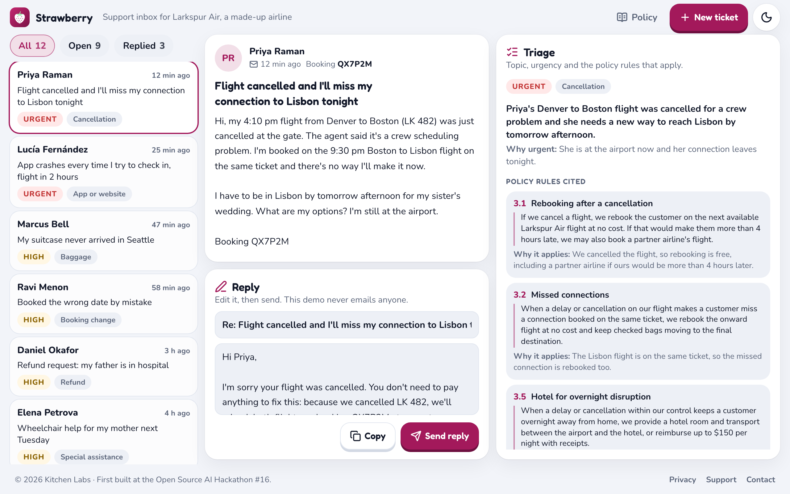

# Strawberry

A support inbox for an airline that triages every customer email: it sorts the ticket by topic
and urgency, finds the policy rules that apply (quoted, with the clause text) and drafts a reply
the agent can edit and send. The airline, Larkspur Air, is made up, and so are its customers.

Live: https://strawberry-pied.vercel.app · Part of [Kitchen Labs](https://kitchenlabs-one.vercel.app).
First built at the Open Source AI Hackathon #16 (April 2025); `presentation/` holds that pitch.



## How it works

- **Sample inbox, zero AI calls.** Twelve tickets ship with their triage and replies written
  ahead of time (`lib/samples.ts`), so the whole app works with no model at all.
- **Your own tickets.** **New ticket** adds an email; **Triage with AI** sends it to
  `POST /api/triage`, which finds 5 candidate rules in the policy with BM25 keyword search
  (`lib/retrieval.ts`) and asks OpenAI `gpt-5.4-mini` for a strict-schema answer that may only
  cite those rules. **Draft without AI** does the same with built-in rules, in the browser.
- **The policy** is markdown (`content/policy.md`), split into clauses and generated into
  `lib/policy/policy.json` by `npm run policy`. `/policy` shows it.
- **No database.** The inbox lives in the browser's local storage.

## Run it

```bash
npm install
npm run dev            # http://localhost:3194
npm run gate           # kit check, typecheck, lint, unit tests, build, leak check
npm run build && npm run e2e
```

Without `OPENAI_API_KEY`, **Triage with AI** answers with the built-in rules and says AI triage is
off; that's how tests run. See `CLAUDE.md` for the operating manual.
